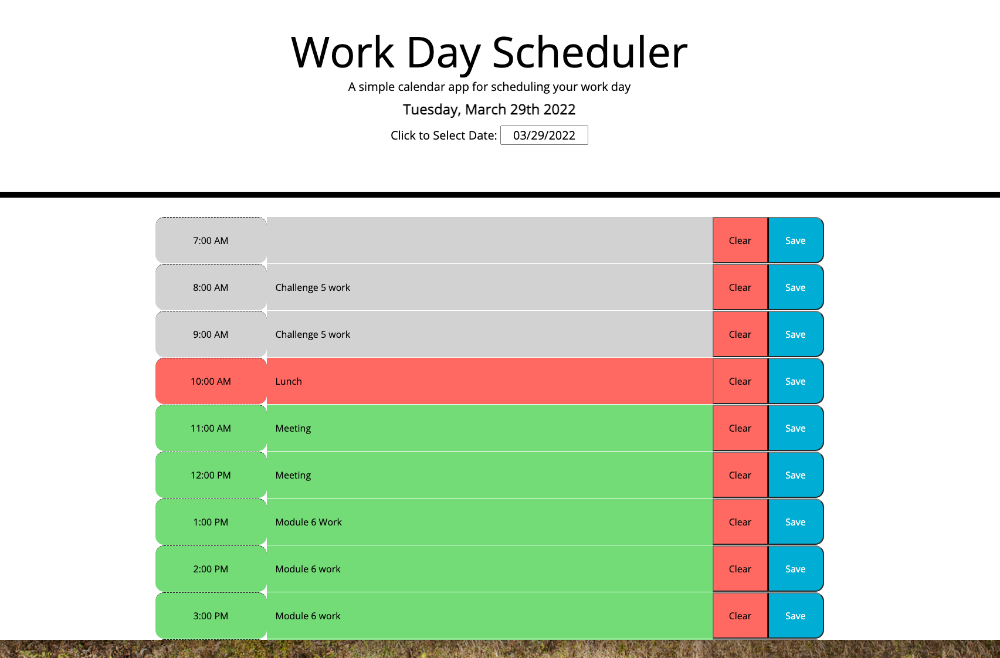

# Work Day Scheduler

## Description

This is a simple daily planner where:

- The current day is displayed at the top on opening the application and you can select any day you desire using a calendar
- On scrolling down there are 1 hour blocks during normal business hours for scheduled events or tasks
- Time blocks are color coded to indicate past(gray), present(red), and future(green)
- Clicking on a time block, you can enter an event or task
- Events or tasks will be saved to localStorage so that they persist on refresh

## Installation

Being a web application, there is no installation per se.  A local file is created in the browser that can be deleted through the Developer Tools or by clearing all browser data.

## Usage

Run at this link:  https://melliott7264.github.io/work-day-scheduler/

On initial load, the calendar comes up showing the current day's schedule.  To select another day, click on the field marked "Click to Select Date:".  A calendar will pop up.  Just select the date desired and the schedule for that day will be loaded.  To add/edit an event, click anywhere in the event description block to the right of the hour block.  A text entry box will appear.  Click in the text entry box and type in the event information you desire.  When you are finished, just move the mouse cursor out of the text entry box.  Your event will be automatically saved.   To be sure, you can click on the blue Save button to the far right.  Click on the Clear button to remove the event from the database.  On clear, you will be asked to confirm that you want to delete the event from the database.

## Credits

Mark Elliott  https://github.com/melliott7264

Code repository for this project: https://github.com/melliott7264/work-day-scheduler

## License

Copyright (c) 2022 Mark Elliott

Permission is hereby granted, free of charge, to any person obtaining a copy
of this software and associated documentation files (the "Software"), to deal
in the Software without restriction, including without limitation the rights
to use, copy, modify, merge, publish, distribute, sublicense, and/or sell
copies of the Software, and to permit persons to whom the Software is
furnished to do so, subject to the following conditions:

The above copyright notice and this permission notice shall be included in all
copies or substantial portions of the Software.

THE SOFTWARE IS PROVIDED "AS IS", WITHOUT WARRANTY OF ANY KIND, EXPRESS OR
IMPLIED, INCLUDING BUT NOT LIMITED TO THE WARRANTIES OF MERCHANTABILITY,
FITNESS FOR A PARTICULAR PURPOSE AND NONINFRINGEMENT. IN NO EVENT SHALL THE
AUTHORS OR COPYRIGHT HOLDERS BE LIABLE FOR ANY CLAIM, DAMAGES OR OTHER
LIABILITY, WHETHER IN AN ACTION OF CONTRACT, TORT OR OTHERWISE, ARISING FROM,
OUT OF OR IN CONNECTION WITH THE SOFTWARE OR THE USE OR OTHER DEALINGS IN THE
SOFTWARE.

---
